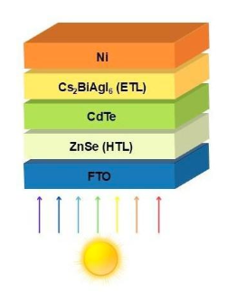
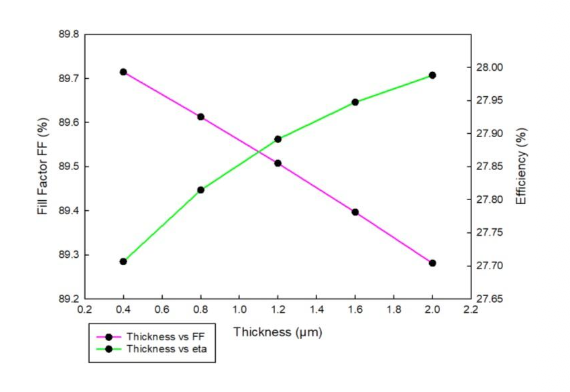
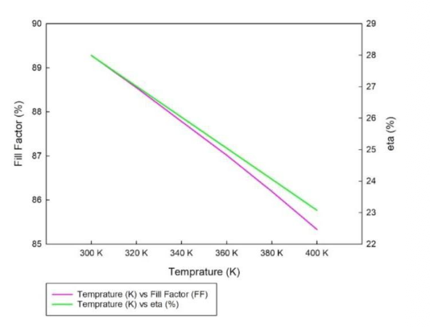
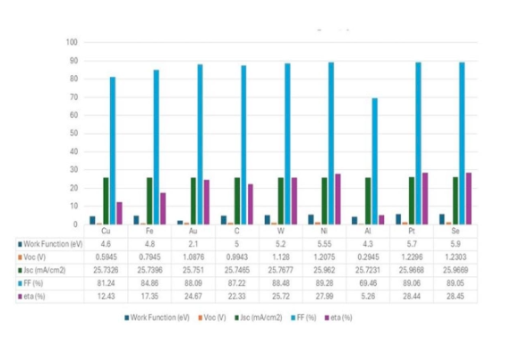

Click the README.md file → pencil icon → delete everything → paste this:

# Simulation of High-Efficiency FTO/ZnSe/CdTe/Cs₂BiAgI₆/Ni Solar Cells Using SCAPS-1D

**Bachelor of Technology Capstone Project** | Chemical Engineering  
**Institution:** Vellore Institute of Technology, Vellore  
**Guide:** Dr. Dharmendra Kumar Bal (Associate Professor, SCHEME, VIT Vellore)  
**Authors:** Soham Kavathekar · Suved Malokar · Sowmyan Nagaraj  
**Year:** April 2025

---

## Awards & Recognition

🏆 **Best Poster Presentation Award** — 61st ACC 2024 Annual Convention of Chemists & International Conference on Emerging Trends in Chemistry, JECRC University, Jaipur (December 2024)

---

## Patents

| # | Title | Design No. | Status | Date |
|---|---|---|---|---|
| 1 | Detachable Spiral Solar Panel | 434427-001 | ✅ Granted | Oct 2024 |
| 2 | Dual-Layer Detachable Spiral Solar Panel | 459195-001 | ✅ Granted | May 2025 |
| 3 | Utility Patent | — | 🔄 Under Technical Review | 2025 |

---

## Why This Research Matters

Silicon-based solar cells dominate the market but are expensive, bulky, and energy-intensive to manufacture. Thin-film solar cells (TFSCs) offer a promising alternative — cheaper, lighter, and scalable — but require careful material selection to achieve competitive efficiencies.

**This study addresses two key challenges:**

1. CdTe is an excellent absorber material but requires a buffer layer — the standard choice (CdS) is toxic and environmentally harmful
2. The electron transport layer (ETL) critically determines how efficiently charge carriers are extracted — but no systematic comparison existed for the ZnSe/CdTe configuration

**Our approach:** Use SCAPS-1D numerical simulation to systematically screen 10 ETL candidates and optimize every layer parameter in a novel FTO/ZnSe/CdTe/ETL/Ni device architecture — replacing toxic CdS with environmentally friendly ZnSe, and identifying Cs₂BiAgI₆ as a breakthrough ETL achieving **27.99% PCE**.

---

## Device Architecture

| Layer | Material | Thickness | Role |
|---|---|---|---|
| Back Contact | Ni | — | Work function 5.55 eV |
| ETL | Cs₂BiAgI₆ | 2 µm | Best performing ETL ✅ |
| Absorber | CdTe | 3 µm | Primary photon absorption |
| Buffer | ZnSe | 0.025 µm | Non-toxic CdS alternative ✅ |
| Front Contact | FTO | 0.4 µm | Transparent conductive oxide |

**Illumination:** AM 1.5G solar spectrum at 1000 W/m², 300 K
---

## Simulation Methodology

**Software:** SCAPS-1D (Solar Cell Capacitance Simulator in 1 Dimension), University of Gent  
**Conditions:** AM 1.5G spectrum, 1000 W/m², 300 K, series resistance ≈ 0, shunt resistance = 1000 Ω·cm²

SCAPS-1D solves three coupled semiconductor equations simultaneously:

- **Poisson's equation** — electrostatic potential distribution
- **Electron continuity equation** — carrier generation and recombination
- **Hole continuity equation** — drift-diffusion transport

Key parameters optimized: ETL material, layer thickness (all layers), metal back contact work function, temperature (300–400 K)

---

## Key Results

### 1. ETL Comparative Study — Cs₂BiAgI₆ Wins

Ten ETL materials were screened under identical conditions:

| ETL | V_OC (V) | J_SC (mA/cm²) | FF (%) | PCE (%) |
|---|---|---|---|---|
| **Cs₂BiAgI₆** | **1.2075** | **25.962** | **89.28** | **27.99** |
| C₆₀ | 1.2278 | 25.43 | 87.98 | 27.50 |
| WS₂ | 1.1466 | 25.43 | 89.4 | 26.07 |
| PCBM | 0.997 | 0.283 | 87.06 | 24.55 |
| Sb₂Se₃ | 0.937 | 25.55 | 85.64 | 20.50 |
| PC₁₆BM | 1.779 | 25.52 | 49.84 | 22.63 |
| CuO | 1.229 | 25.43 | 87.98 | 27.50 |
| Cu₂O | 1.779 | 25.52 | 49.84 | 22.63 |
| TiO₂ | 1.050 | 19.33 | 68.90 | 13.99 |
| WO₃ | 1.364 | 9.288 | 58.17 | 7.37 |

---

### 2. ETL Thickness Optimization

| Thickness (µm) | V_OC (V) | J_SC (mA/cm²) | FF (%) | PCE (%) |
|---|---|---|---|---|
| 0.4 | 1.206455 | 25.598 | 89.7147 | 27.7064 |
| 0.8 | 1.206764 | 25.720 | 89.6129 | 27.8145 |
| 1.2 | 1.207031 | 25.816 | 89.5075 | 27.8914 |
| 1.6 | 1.207264 | 25.895 | 89.3968 | 27.9474 |
| **2.0** | **1.207472** | **25.962** | **89.2809** | **27.9882** |

Optimal ETL thickness: **2 µm**

---

### 3. Temperature Dependence (300–400 K)

| Temp. (K) | V_OC (V) | J_SC (mA/cm²) | FF (%) | PCE (%) |
|---|---|---|---|---|
| **300** | **1.207472** | **25.962** | **89.2809** | **27.9882** |
| 320 | 1.174975 | 25.962 | 88.5507 | 27.0121 |
| 340 | 1.142219 | 25.962 | 87.7825 | 26.0313 |
| 360 | 1.110000 | 25.962 | 87.0165 | 25.0473 |
| 380 | 1.080000 | 26.000 | 86.2000 | 24.0608 |
| 400 | 1.040000 | 26.000 | 85.3000 | 23.1000 |

PCE drops from 27.99% at 300 K to 23.10% at 400 K due to increased carrier collisions and reduced mobility at elevated temperatures.

---

### 4. FTO Thickness — Inverse Relationship with PCE

| Thickness (µm) | PCE (%) |
|---|---|
| 0.4 | 27.8858 |
| 0.8 | 27.617 |
| 1.2 | 27.3793 |
| 1.6 | 27.1607 |
| 2.0 | 26.9556 |

Optimal FTO thickness: **0.4 µm**

---

### 5. Metal Back Contact Comparison

| Metal | Work Function (eV) | PCE (%) |
|---|---|---|
| Cu | 4.6 | 12.43 |
| Fe | 4.8 | 17.35 |
| Au | 2.1 | 24.67 |
| C | 5.0 | 22.33 |
| W | 5.2 | 25.72 |
| **Ni** | **5.55** | **27.99** |
| Al | 4.3 | 5.26 |
| Pt | 5.7 | 28.44 |
| Se | 5.9 | 28.45 |

Se and Pt slightly outperform Ni but are toxic/expensive at scale. **Ni is the optimal practical choice.**

---

## Repository Contents

| File | Description |
|---|---|
| `Project_Report.pdf` | Full B.Tech capstone thesis |
| `Conference_Poster.pdf` | Poster presented at ACC 2024 — Best Poster Award |
| `Patent_1_434427-001.pdf` | Granted design patent — Detachable Spiral Solar Panel |
| `Patent_2_459195-001.pdf` | Granted design patent — Dual-Layer Detachable Spiral Solar Panel |
| `Cs2BiAgI6_Temperature_Data.xlsx` | SCAPS-1D output — temperature dependence study |

---

## Conclusions

- **Cs₂BiAgI₆ is the optimal ETL** for this configuration, achieving PCE of **27.99%** with Ni and **28.45%** with Se
- **ZnSe successfully replaces toxic CdS** as a buffer layer without sacrificing performance
- **Optimal parameters:** ETL = 2 µm, CdTe = 2 µm, FTO = 0.4 µm, T = 300 K
- **Temperature is a critical deployment factor** — PCE drops ~17% from 300 K to 400 K
- This work produced **2 granted design patents** and a **utility patent under review**

---

## Contact

**Soham Kavathekar**  
MS Chemical & Biomolecular Engineering, University of Pennsylvania  
📧 stg3719@seas.upenn.edu  

