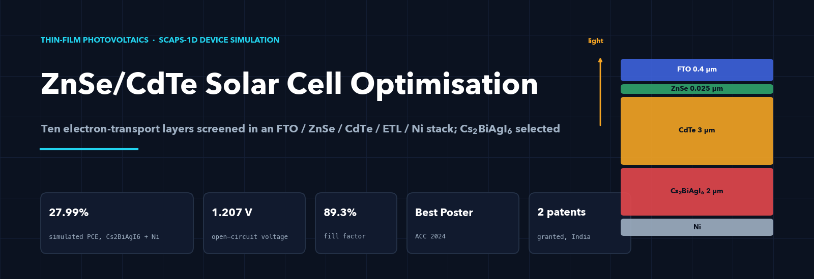
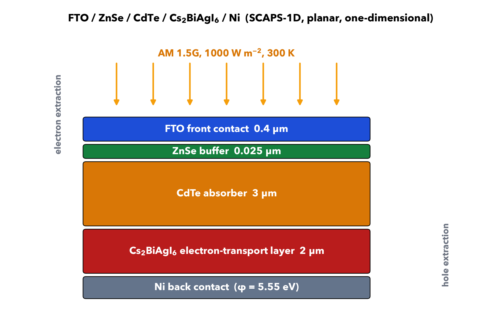
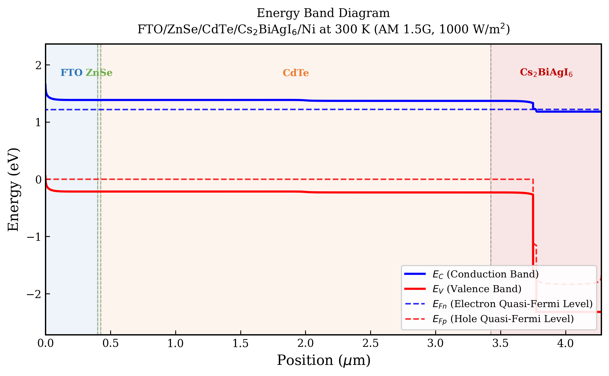
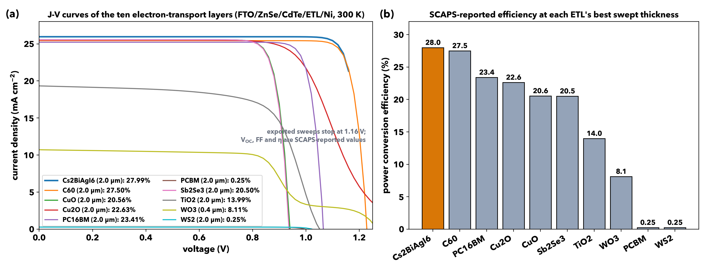
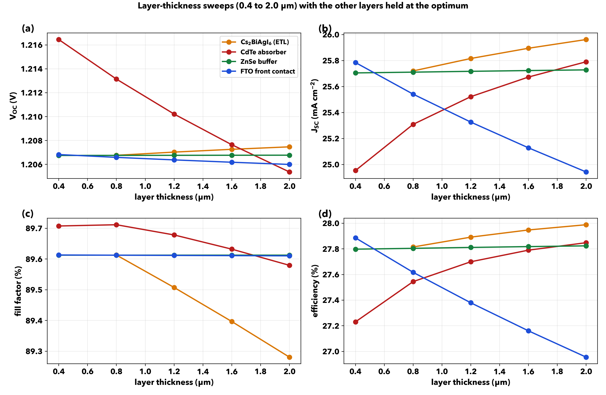
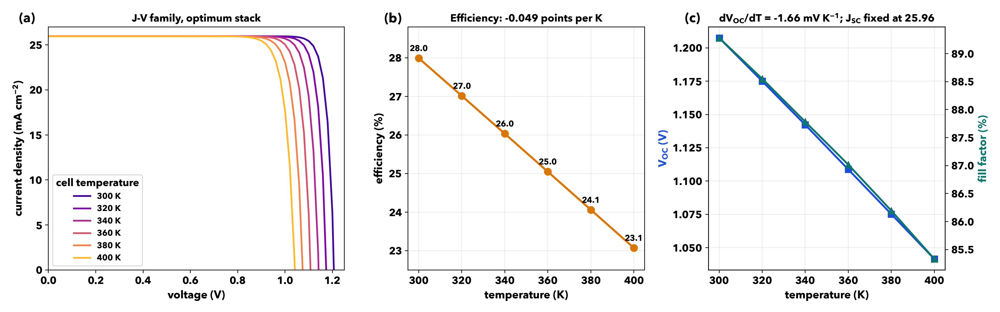
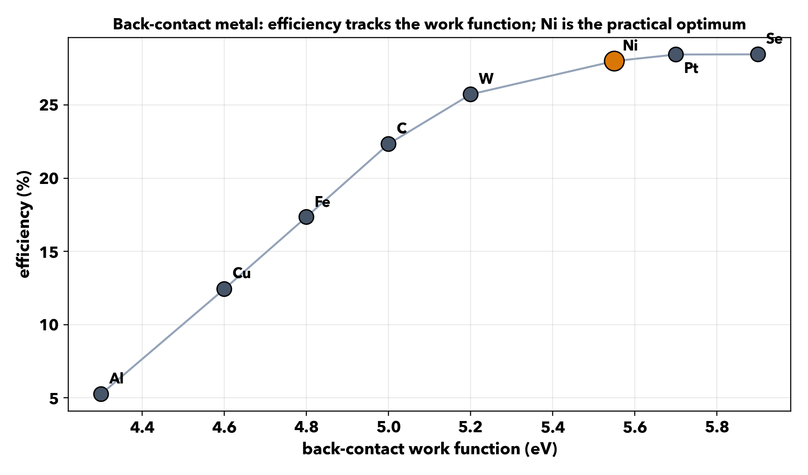

<p align="center"></p>

<div align="center">

[](https://scaps.elis.ugent.be/)
[](Conference_Poster.pdf)
[](#patents)
[](Project_Report.pdf)
[](scripts/make_figures.py)

**Soham Kavathekar** · Suved Malokar · Sowmyan Nagaraj
B.Tech Chemical Engineering capstone, Vellore Institute of Technology, April 2025 · Guide: Dr. Dharmendra Kumar Bal

</div>

---

## The one-sentence version

**Replace the toxic CdS buffer in a CdTe thin-film cell with ZnSe, screen ten electron-transport layers and nine back-contact metals in SCAPS-1D, and the lead-free double perovskite Cs₂BiAgI₆ with a nickel contact gives a simulated power-conversion efficiency of 27.99 %.**

This is a device-physics simulation study, not a fabricated cell. Every number below is read directly from the SCAPS-1D batch exports in [`data/`](data/), and every figure is regenerated from them by [`scripts/make_figures.py`](scripts/make_figures.py). Where the April 2025 report disagrees with the exports, the exports win and the disagreement is listed in [Known issues](#known-issues-in-the-original-report).

## Contents

1. [Why this device](#why-this-device)
2. [Device architecture](#device-architecture)
3. [How SCAPS-1D simulates a cell](#how-scaps-1d-simulates-a-cell)
4. [Material parameters](#material-parameters)
5. [Results](#results): [ETL screening](#1-electron-transport-layer-screening) · [Layer thickness](#2-layer-thickness-sweeps) · [Temperature](#3-temperature) · [Back contact](#4-back-contact-metal)
6. [What the study does and does not show](#what-the-study-does-and-does-not-show)
7. [Reproduce the figures](#reproduce-the-figures)
8. [Known issues in the original report](#known-issues-in-the-original-report)
9. [Patents](#patents) · [Files](#files) · [Contact](#contact)

---

## Why this device

Commercial CdTe modules use a CdS window layer. CdS absorbs below about 510 nm (band gap 2.4 eV), so blue photons are lost before they reach the absorber, and cadmium sulfide adds a second toxic compound to the stack. ZnSe has a wider gap (2.9 eV in the parameter set used here), so it passes more of the spectrum to the CdTe, and it avoids the sulfide. The second design question is what sits between the absorber and the metal: the report calls this layer the electron-transport layer (ETL) and screens ten candidates for it, from oxides (TiO₂, WO₃, CuO, Cu₂O) through fullerenes (C₆₀, PCBM, PC₁₆BM) and chalcogenides (WS₂, Sb₂Se₃) to the lead-free double perovskite Cs₂BiAgI₆. The third question is the back contact, which for a p-type absorber must not form a Schottky barrier to holes.

## Device architecture

<p align="center"></p>

| Layer | Material | Thickness at the optimum | What it does | What the sweep showed |
|---|---|---|---|---|
| Front contact | FTO (fluorine-doped SnO₂) | 0.4 µm | transparent conductor, collects electrons | thinner is better: PCE 27.89 → 26.96 % from 0.4 to 2.0 µm, because a thicker TCO absorbs more light before the junction |
| Buffer / window | ZnSe | 0.025 µm | non-toxic CdS replacement, n-side of the junction | performance flat to ±0.02 points across 0.4 to 2.0 µm |
| Absorber | p-CdTe | 3 µm | direct-gap (1.5 eV) light absorption, generates the photocurrent | J<sub>SC</sub> rises with thickness (more photons absorbed), V<sub>OC</sub> falls slightly (more bulk recombination); PCE 27.23 → 27.85 % |
| Electron-transport layer | screened; Cs₂BiAgI₆ selected | 2 µm | band-matched layer between absorber and metal | PCE rises with thickness, 27.81 → 27.99 % |
| Back contact | Ni (work function 5.55 eV) | metal boundary | extracts holes without a barrier | efficiency tracks the metal work function (see below) |

<p align="center"></p>

Light enters through the FTO. The ZnSe/CdTe interface is the p-n junction; the built-in field there separates the photogenerated carriers. The ETL sits between the CdTe and the metal, and the metal work function sets whether holes leave the CdTe freely or over a barrier.

## How SCAPS-1D simulates a cell

SCAPS-1D (Solar Cell Capacitance Simulator, M. Burgelman et al., University of Gent) is a one-dimensional drift-diffusion solver. It divides the stack into a mesh along the depth coordinate x and solves three coupled equations at every node:

**Poisson's equation** for the electrostatic potential ψ, given the free carriers n and p, the ionised dopants N<sub>D</sub><sup>+</sup> and N<sub>A</sub><sup>−</sup> and the trapped charge ρ<sub>t</sub>:

$$\frac{d^2\psi}{dx^2} = -\frac{q}{\varepsilon_0\varepsilon_r}\left[p(x) - n(x) + N_D^+(x) - N_A^-(x) + \rho_t(x)\right]$$

**Continuity equations** for electrons and holes, balancing the divergence of each current density against generation G and recombination R:

$$\frac{1}{q}\frac{dJ_n}{dx} = R_n(x) - G(x), \qquad \frac{1}{q}\frac{dJ_p}{dx} = G(x) - R_p(x)$$

**Drift-diffusion transport**, which closes the system by writing each current as a field-driven drift term plus a gradient-driven diffusion term:

$$J_n = q\mu_n n E + qD_n\frac{dn}{dx}, \qquad J_p = q\mu_p p E - qD_p\frac{dp}{dx}$$

Generation G(x) comes from the AM 1.5G spectrum attenuated through the stack with each layer's absorption coefficient; recombination includes band-to-band (radiative), Shockley-Read-Hall through the defect levels entered for each layer and interface, and Auger. The solver sweeps the applied voltage, obtains J(V), then reports V<sub>OC</sub> (J = 0), J<sub>SC</sub> (V = 0), the maximum-power point and the fill factor FF = P<sub>max</sub>/(V<sub>OC</sub> J<sub>SC</sub>). Efficiency is P<sub>max</sub> divided by the 100 mW cm⁻² incident power, so under one sun the efficiency in percent equals P<sub>max</sub> in mW cm⁻². The exported sweeps in `data/` stop at 1.16 V, before the J = 0 crossing for the best stacks, so the V<sub>OC</sub>, FF and η used here are the values SCAPS itself writes into each export; P<sub>max</sub> recomputed from the sweep matches SCAPS's η to within 0.05 points for every case.

**Simulation conditions.** Illumination AM 1.5G, 1000 W m⁻² (one sun); working point 300 K unless stated; frequency 1 MHz for the capacitance routines; series resistance taken as negligible and shunt resistance 1000 Ω cm²; no optical reflection filter beyond the front glass; planar layers, no texture; interface defect densities as entered in the definition files; batch mode used to sweep one parameter at a time while holding the others at the optimum.

## Material parameters

Inputs for the layers tabulated in the report (Table 2, sources [13–19] there). Four ETLs (CuO, Cu₂O, Sb₂Se₃, TiO₂) were parameterised from the literature in the SCAPS definition files but are not tabulated in the report; their values are therefore not reproduced here rather than reconstructed.

| Property | FTO | ZnSe | p-CdTe | WS₂ | PCBM | Cs₂BiAgI₆ | WO₃ | C₆₀ | PC₁₆BM |
|---|---|---|---|---|---|---|---|---|---|
| Band gap E<sub>g</sub> (eV) | 3.50 | 2.9 | 1.50 | 1.80 | 2.0 | 1.60 | 2.6 | 1.70 | 2.1 |
| Electron affinity χ (eV) | 4.00 | 4.0 | 3.90 | 3.95 | 3.9 | 3.90 | 3.8 | 3.90 | 4.0 |
| Relative permittivity ε<sub>r</sub> | 9.00 | 10.0 | 9.40 | 13.60 | 3.9 | 6.50 | 4.80 | 4.20 | 9 |
| N<sub>C</sub> (cm⁻³) | 2.2×10¹⁸ | 1.5×10¹⁸ | 8.0×10¹⁷ | 1.0×10¹⁸ | 2.5×10²¹ | 2.2×10¹⁸ | 2.2×10²¹ | 8×10¹⁹ | 2.2×10¹⁸ |
| N<sub>V</sub> (cm⁻³) | 1.8×10¹⁹ | 1.8×10¹⁹ | 1.8×10¹⁹ | 2.4×10¹⁹ | 2.5×10²¹ | 1.8×10¹⁹ | 2.2×10²¹ | 8×10¹⁹ | 2.2×10¹⁹ |
| Thermal velocities v<sub>e</sub>, v<sub>h</sub> (cm s⁻¹) | 10⁷ | 10⁷ | 10⁷ | 10⁷ | 10⁷ | 10⁷ | 10⁷ | 10⁷ | 10⁷ |
| µ<sub>e</sub> (cm² V⁻¹ s⁻¹) | 20 | 25 | 320 | 100 | 0.2 | 2 | 30 | 0.08 | 20 |
| µ<sub>h</sub> (cm² V⁻¹ s⁻¹) | 10 | 20 | 40 | 100 | 0.2 | 2 | 30 | 0.0035 | 10 |
| N<sub>D</sub> (cm⁻³) | 1×10¹⁹ | 1.1×10¹⁸ | 0 | 1.0×10¹⁸ | 2.93×10¹⁷ | 0 | 6.35×10¹⁷ | 1×10¹⁷ | 1×10²¹ |
| N<sub>A</sub> (cm⁻³) | 1.0×10¹⁴ | 0 | 2.0×10¹⁴ | 0 | 0 | 1×10¹⁵ | 0 | 0 | 0 |

The report's thickness row lists nominal definition-file values (for example 800 for Cs₂BiAgI₆, a units slip for 0.8 µm); the thicknesses actually used are the ones in the sweeps below.

---

## Results

### 1. Electron-transport-layer screening

<p align="center"></p>

Each ETL was swept from 0.4 to 2.0 µm with the rest of the stack fixed (FTO 0.4 / ZnSe 0.025 / CdTe 3 µm / Ni). The table reports each material at its best swept thickness.

| ETL | best swept thickness (µm) | V<sub>OC</sub> (V) | J<sub>SC</sub> (mA cm⁻²) | FF (%) | PCE (%) |
|---|---|---|---|---|---|
| **Cs₂BiAgI₆** | **2.0** | **1.207** | **25.96** | **89.28** | **27.99** |
| C₆₀ | 2.0 | 1.229 | 25.43 | 87.98 | 27.50 |
| PC₁₆BM | 2.0 | 1.066 | 25.22 | 87.09 | 23.41 |
| Cu₂O | 2.0 | 1.779 | 25.52 | 49.84 | 22.63 |
| CuO | 2.0 | 0.940 | 25.55 | 85.58 | 20.56 |
| Sb₂Se₃ | 2.0 | 0.937 | 25.55 | 85.64 | 20.50 |
| TiO₂ | 2.0 | 1.050 | 19.33 | 68.90 | 13.99 |
| WO₃ | 0.4 | 1.266 | 10.71 | 59.78 | 8.11 |
| PCBM | 2.0 | 0.996 | 0.28 | 87.06 | 0.25 |
| WS₂ | 2.0 | 1.023 | 0.27 | 87.59 | 0.25 |

**Reading the table.** Cs₂BiAgI₆ and C₆₀ share near-ideal fill factors and almost the full 26 mA cm⁻² that a 1.5 eV absorber can deliver under AM 1.5G; they differ by half a point. Both have χ = 3.90 eV, identical to CdTe, so there is no conduction-band step at the absorber/ETL interface in this parameter set. Cu₂O reaches the highest V<sub>OC</sub> of the set (1.78 V) but its fill factor is 50 %: the J-V curve in panel (a) is soft rather than square, the signature of an extraction barrier. TiO₂ loses a quarter of the current. PCBM and WS₂ collapse to under 0.3 mA cm⁻² while keeping a normal V<sub>OC</sub> and fill factor, so the loss is in collection, not in the junction; WO₃ behaves the same way once it is thicker than about 0.4 µm. A firm attribution for the collapses would need the per-layer band-diagram and recombination-profile outputs, which were not exported, so this README stops at the observation.

### 2. Layer-thickness sweeps

<p align="center"></p>

With Cs₂BiAgI₆ selected, each layer was swept in turn from 0.4 to 2.0 µm (ZnSe's default is 0.025 µm; the sweep tests whether a thicker buffer would matter, and it does not).

**Cs₂BiAgI₆ electron-transport layer**

| thickness (µm) | V<sub>OC</sub> (V) | J<sub>SC</sub> (mA cm⁻²) | FF (%) | PCE (%) |
|---|---|---|---|---|
| 0.8 | 1.2068 | 25.72 | 89.61 | 27.81 |
| 1.2 | 1.2070 | 25.82 | 89.51 | 27.89 |
| 1.6 | 1.2073 | 25.90 | 89.40 | 27.95 |
| **2.0** | **1.2075** | **25.96** | **89.28** | **27.99** |

**CdTe absorber**

| thickness (µm) | V<sub>OC</sub> (V) | J<sub>SC</sub> (mA cm⁻²) | FF (%) | PCE (%) |
|---|---|---|---|---|
| 0.4 | 1.2164 | 24.95 | 89.71 | 27.23 |
| 0.8 | 1.2131 | 25.31 | 89.71 | 27.54 |
| 1.2 | 1.2102 | 25.52 | 89.68 | 27.70 |
| 1.6 | 1.2076 | 25.67 | 89.63 | 27.79 |
| **2.0** | **1.2054** | **25.79** | **89.58** | **27.85** |

**ZnSe buffer**

| thickness (µm) | V<sub>OC</sub> (V) | J<sub>SC</sub> (mA cm⁻²) | FF (%) | PCE (%) |
|---|---|---|---|---|
| 0.4 | 1.2067 | 25.71 | 89.61 | 27.80 |
| 0.8 | 1.2068 | 25.71 | 89.61 | 27.80 |
| 1.2 | 1.2068 | 25.72 | 89.61 | 27.81 |
| 1.6 | 1.2068 | 25.72 | 89.61 | 27.82 |
| **2.0** | **1.2068** | **25.73** | **89.61** | **27.82** |

**FTO front contact**

| thickness (µm) | V<sub>OC</sub> (V) | J<sub>SC</sub> (mA cm⁻²) | FF (%) | PCE (%) |
|---|---|---|---|---|
| **0.4** | **1.2068** | **25.78** | **89.61** | **27.89** |
| 0.8 | 1.2066 | 25.54 | 89.61 | 27.62 |
| 1.2 | 1.2064 | 25.33 | 89.61 | 27.38 |
| 1.6 | 1.2062 | 25.13 | 89.61 | 27.16 |
| 2.0 | 1.2060 | 24.94 | 89.61 | 26.96 |

Three trends carry the design: the absorber gains current with thickness and loses a little voltage; the front contact loses current with thickness, since a thicker TCO is a parasitic absorber; the buffer is inert. The ETL trend is small in absolute terms (0.18 points across the sweep) and the report's choice of 2 µm is the end of the swept range rather than a resolved optimum.

### 3. Temperature

<p align="center"></p>

| T (K) | V<sub>OC</sub> (V) | J<sub>SC</sub> (mA cm⁻²) | FF (%) | PCE (%) |
|---|---|---|---|---|
| 300 | 1.207 | 25.96 | 89.28 | 27.99 |
| 320 | 1.175 | 25.96 | 88.55 | 27.01 |
| 340 | 1.142 | 25.96 | 87.78 | 26.03 |
| 360 | 1.109 | 25.96 | 87.02 | 25.05 |
| 380 | 1.075 | 25.96 | 86.19 | 24.06 |
| 400 | 1.041 | 25.96 | 85.33 | 23.07 |

J<sub>SC</sub> does not move (generation is set by the spectrum and the absorption profile, neither of which is temperature-dependent in this model). V<sub>OC</sub> falls at -1.66 mV K⁻¹ because the dark saturation current rises with temperature, and the fill factor follows it. The net efficiency coefficient is -0.049 points per kelvin, or about -0.18 % K⁻¹ relative, which is milder than the −0.35 to −0.45 % K⁻¹ typical of crystalline silicon modules; wide-gap absorbers and high V<sub>OC</sub> generally give smaller relative coefficients.

### 4. Back-contact metal

<p align="center"></p>

| Metal | Work function used (eV) | PCE (%) |
|---|---|---|
| Al | 4.3 | 5.26 |
| Cu | 4.6 | 12.43 |
| Fe | 4.8 | 17.35 |
| C | 5.0 | 22.33 |
| W | 5.2 | 25.72 |
| **Ni** | **5.55** | **27.99** |
| Pt | 5.7 | 28.44 |
| Se | 5.9 | 28.45 |

For a p-type absorber the metal has to line up with the valence band. In this parameter set the CdTe valence-band edge sits at χ + E<sub>g</sub> = 3.9 + 1.5 = 5.4 eV below vacuum, so a metal with a smaller work function leaves a hole barrier of roughly (5.4 − φ<sub>m</sub>) eV: about 1.1 eV for aluminium, 0.2 eV for tungsten, none for nickel and above. That is why the curve saturates just past 5.4 eV. Pt and Se edge out Ni by under half a point but are respectively scarce and toxic, so Ni is the practical optimum. The report also lists a gold contact with a recorded work function that does not match literature values (about 5.1 eV), so that row is omitted here pending a re-check.

---

## What the study does and does not show

- **It shows** which of ten candidate layers and nine metals are compatible with a ZnSe/CdTe junction in a drift-diffusion model, how each layer's thickness trades current against voltage, and how the optimum stack derates with temperature.
- **It does not show** an achievable cell efficiency. SCAPS-1D is one-dimensional and planar; the model has no grain boundaries, no texture or anti-reflection design beyond the front glass, negligible series resistance, and only the interface defects that were entered. The 27.99 % figure is a ceiling for this parameter set, several points above the record for any CdTe device.
- **The input parameters are literature values**, several of them (mobilities, densities of states for the organic layers) with order-of-magnitude uncertainty. The ranking of the ETLs is more robust than the absolute numbers.
- **Cs₂BiAgI₆ has not been demonstrated as an ETL on CdTe experimentally**; the study is a motivation for trying it, not evidence that it works.

## Reproduce the figures

```bash
pip install numpy openpyxl matplotlib
python scripts/make_figures.py
```

The script reads the eleven SCAPS batch exports in `data/` (one workbook per ETL, sheets `ETL VARY DP1..5` for the thickness points, plus the CdTe, ZnSe and FTO sweeps in the Cs₂BiAgI₆ workbook and a six-sheet temperature workbook), pulls the `Voc = / Jsc = / FF = / eta =` rows SCAPS writes into each sheet, cross-checks η against P<sub>max</sub> from the sweep, writes `data/scaps_metrics.json` and draws the five figures in `figures/`. The tables in this README are generated from the same JSON.

## Known issues in the original report

The April 2025 report was corrected in July 2025; this README goes back to the raw exports, which agree with the corrections. For the record:

- Tables 3.1 to 3.3 of the report (C₆₀, Cs₂BiAgI₆, CuO thickness sweeps) are the same block of numbers pasted three times, and Tables 3.4 and 3.5 (Cu₂O, PC₁₆BM) are likewise duplicates. The per-material values are in the [thickness tables](#2-layer-thickness-sweeps) above.
- PCBM's efficiency is given as 14.55 to 24.55 % in Table 3.6; the export gives 0.15 to 0.25 %. WS₂ is correct in the report (0.16 to 0.25 %), which is what makes the PCBM row identifiable as a transcription error.
- The WO₃ export covers only three thickness points (0.4, 1.6, 2.0 µm), not five. The corrected July table lists WO₃ at 7.37 % (V<sub>OC</sub> 1.364 V, J<sub>SC</sub> 9.29 mA cm⁻²); the raw 0.4 µm export gives 8.11 % (1.266 V, 10.71 mA cm⁻²). The two do not come from the same run and the discrepancy is unresolved; the export value is used here.
- The nominal thickness row in the report's parameter table (Table 2) mixes units; see the note under [Material parameters](#material-parameters).

## Patents

The project's hardware concept, a detachable spiral thin-film panel geometry with about 18 % more active area than a planar panel of the same footprint, was filed in India by the team:

| | Title | Number | Status |
|---|---|---|---|
| 1 | Detachable Spiral Solar Panel | 434427-001 | granted, October 2024 |
| 2 | Dual-Layer Detachable Spiral Solar Panel | 459195-001 | granted, May 2025 |
| 3 | Method of Fabricating Detachable Spiral Thin-Film Energy Devices | utility | under review |

Certificates: [`PATENT 1.pdf`](PATENT%201.pdf), [`PATENT 2.pdf`](PATENT%202.pdf).

## Files

| Path | What it is |
|---|---|
| `data/*.xlsx` | raw SCAPS-1D batch exports: one workbook per ETL (thickness sweeps; the Cs₂BiAgI₆ workbook also holds the CdTe, ZnSe and FTO sweeps) and the temperature study |
| `data/scaps_metrics.json` | every metric used in this README, machine-readable |
| `scripts/make_figures.py` | regenerates the figures and the JSON from the exports |
| `figures/` | device stack, band diagram, ETL screening, thickness sweeps, temperature, back contact |
| `Project_Report.pdf` | full capstone thesis (April 2025) |
| `Conference_Poster.pdf` | poster presented at the 61st Annual Convention of Chemists (ACC 2024), Best Poster Award |

## Contact

Soham Kavathekar · MS Chemical & Biomolecular Engineering, University of Pennsylvania · [stg3719@seas.upenn.edu](mailto:stg3719@seas.upenn.edu) · [LinkedIn](https://www.linkedin.com/in/soham-kavathekar-cheme) · [GitHub](https://github.com/Soham-ChemE)
