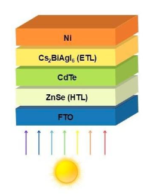
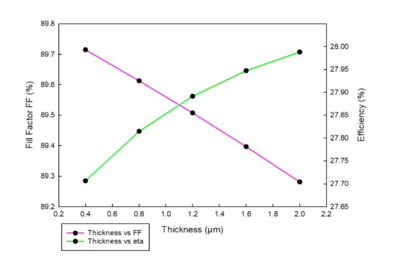
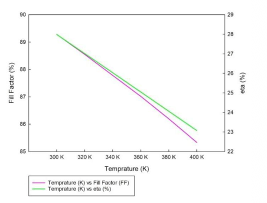
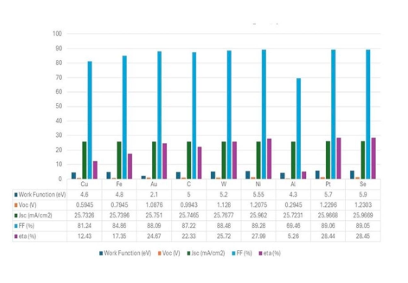

**Soham Kavathekar** · Suved Malokar · Sowmyan Nagaraj
B.Tech Chemical Engineering capstone, Vellore Institute of Technology, April 2025 · Guide: Dr. Dharmendra Kumar Bal

---

## The one-sentence version

**Replace the toxic CdS buffer in a CdTe thin-film cell with ZnSe, screen ten electron-transport layers, and the lead-free double perovskite Cs₂BiAgI₆ gives a simulated power-conversion efficiency of 27.99 % with a nickel back contact.**

This is a device-physics simulation study, not a fabricated cell. SCAPS-1D solves Poisson's equation and the electron and hole continuity equations through the FTO / ZnSe / CdTe / ETL / metal stack under AM 1.5G, 1000 W m⁻², 300 K. The efficiencies are theoretical ceilings for the stated parameters.

---

## Device

| Layer | Material | Thickness | Role |
|---|---|---|---|
| Front contact | FTO | 0.4 µm | transparent conductive oxide; thinner is better (PCE falls 27.89 → 26.96 % from 0.4 to 2.0 µm) |
| Buffer | ZnSe | 0.025 µm | non-toxic replacement for CdS |
| Absorber | CdTe | 3 µm | primary photon absorption, direct gap |
| Electron transport layer | screened, Cs₂BiAgI₆ selected | 2 µm | band alignment to CdTe |
| Back contact | Ni | work function 5.55 eV | practical alternative to Pt or Se |

---

## Results

### Electron-transport-layer screening

Ten ETLs were simulated in the same stack. Values are from the corrected results tables (July 2025), which supersede the April 2025 report where the two differ; the raw SCAPS batch exports in the project data confirm the corrected values.

| ETL | VOC (V) | JSC (mA cm⁻²) | FF (%) | PCE (%) |
|---|---|---|---|---|
| **Cs₂BiAgI₆** | **1.207** | **25.96** | **89.28** | **27.99** |
| C₆₀ | 1.229 | 25.43 | 87.98 | 27.50 |
| PC₁₆BM | 1.066 | 25.22 | 87.09 | 23.41 |
| Cu₂O | 1.779 | 25.52 | 49.84 | 22.63 |
| CuO | 0.940 | 25.55 | 85.58 | 20.56 |
| Sb₂Se₃ | 0.937 | 25.55 | 85.64 | 20.50 |
| TiO₂ | 1.050 | 19.33 | 68.90 | 13.99 |
| WO₃ | 1.364 | 9.29 | 58.17 | 7.37 |
| PCBM | 0.996 | 0.28 | 87.1 | 0.25 |
| WS₂ | 1.023 | 0.27 | 87.59 | 0.25 |

Cs₂BiAgI₆ and C₆₀ share near-ideal fill factors and short-circuit currents; Cu₂O's high VOC is undone by a fill factor of 50 %; PCBM and WS₂ collapse to sub-milliamp currents in this stack, an alignment failure rather than a marginal loss.

### Thickness optimisation of the selected ETL

| Cs₂BiAgI₆ thickness (µm) | VOC (V) | JSC (mA cm⁻²) | FF (%) | PCE (%) |
|---|---|---|---|---|
| 0.4 | 1.2065 | 25.60 | 89.71 | 27.71 |
| 0.8 | 1.2068 | 25.72 | 89.61 | 27.81 |
| 1.2 | 1.2070 | 25.82 | 89.51 | 27.89 |
| 1.6 | 1.2073 | 25.90 | 89.40 | 27.95 |
| **2.0** | **1.2075** | **25.96** | **89.28** | **27.99** |

### Temperature

PCE falls from 27.99 % at 300 K to 23.10 % at 400 K, almost entirely through VOC (1.207 → 1.040 V, about −1.7 mV K⁻¹) while JSC is flat; the usual thermal signature of a well-behaved junction.

### Back contact

| Metal | Work function used (eV) | PCE (%) |
|---|---|---|
| Al | 4.3 | 5.26 |
| Cu | 4.6 | 12.43 |
| Fe | 4.8 | 17.35 |
| C | 5.0 | 22.33 |
| W | 5.2 | 25.72 |
| **Ni** | **5.55** | **27.99** |
| Pt | 5.7 | 28.44 |
| Se | 5.9 | 28.45 |

Efficiency tracks the back-contact work function through the Schottky barrier at the metal interface. Pt and Se edge out Ni but are respectively scarce and toxic; Ni is the practical optimum. (The report also lists a gold contact; its recorded work function does not match literature values, so that row is omitted here pending a re-check.)

---

## Patents

The project's hardware concept, a detachable spiral thin-film panel geometry with about 18 % more active area than a planar panel of the same footprint, was filed in India by the team:

| | Title | Number | Status |
|---|---|---|---|
| 1 | Detachable Spiral Solar Panel | 434427-001 | granted, October 2024 |
| 2 | Dual-Layer Detachable Spiral Solar Panel | 459195-001 | granted, May 2025 |
| 3 | Method of Fabricating Detachable Spiral Thin-Film Energy Devices | utility | under review |

Certificates: [`PATENT 1.pdf`](PATENT%201.pdf), [`PATENT 2.pdf`](PATENT%202.pdf).

---

## Files

| File | What it is |
|---|---|
| `Project_Report.pdf` | full capstone thesis |
| `Conference_Poster.pdf` | poster presented at the 61st Annual Convention of Chemists (ACC 2024), Best Poster Award |
| `Cs2BiAgI6_Temperature_Data.xlsx` | SCAPS-1D output for the temperature study |
| `device_architecture.png`, `band_diagram.png`, `etl_thickness_optimization.png`, `temperature_ff_pce.png`, `metalcontact_comparison.png` | figures |

## Scope

SCAPS-1D is a one-dimensional drift-diffusion solver. Results depend on the material parameters entered (band gaps, affinities, mobilities, defect densities) and represent an idealised planar device without interface defect states beyond those specified, optical losses at the front glass, or series resistance. The 27.99 % figure is an upper bound for this parameter set, not an achievable cell efficiency. A manuscript describing this work is in preparation.

## Contact

Soham Kavathekar · MS Chemical & Biomolecular Engineering, University of Pennsylvania · [stg3719@seas.upenn.edu](mailto:stg3719@seas.upenn.edu) · [LinkedIn](https://www.linkedin.com/in/soham-kavathekar-72a22b246)
